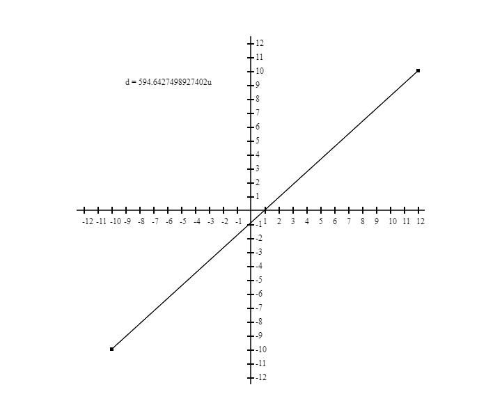

# Distance Between Two Points



## About

An application on the representation of the distance between two points using
canvas. I do it so I can practice and finish my analytical geometry homework faster.

## Getting Started

These instructions will get you a copy of the project up and running on your local machine for development and testing purposes.

### Prerequisites

Make sure you have installed all of the following prerequisites on your development machine:

- Git - [Download & Install Git](https://git-scm.com/downloads). OSX and Linux machines typically have this already installed.
- Node.js - [Download & Install Node.js](https://nodejs.org/en/download/) and the npm package manager.

### Installing

```shell
# Clone repository
git clone https://github.com/dannielsss/distance-between-two-points.git

# Enter the folder
cd distance-between-two-points

# Install dependencies
npm install

# Run project
npm run dev
```

<!-- ## Usage <a name = "usage"></a>

Add notes about how to use the system. -->
